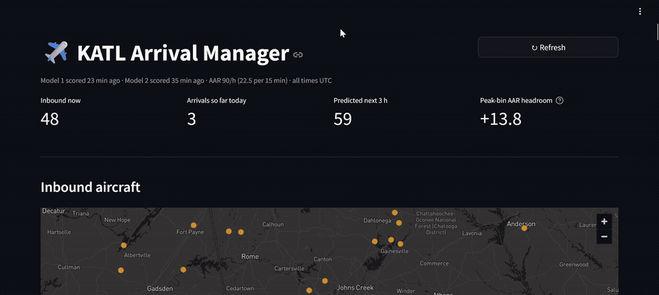
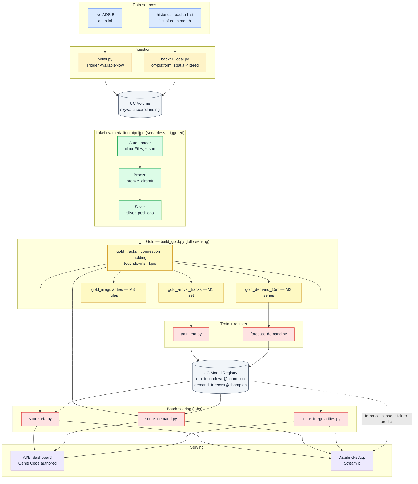

# SkyWatch

[](https://www.databricks.com/product/faq/free-edition)
[](databricks.yml)
[](app/)
[](pitch.md)

An **Arrival Manager** for a hub airport, built end-to-end on **Databricks Free Edition** for
the Databricks Builder Launchpad. Turns the free ADS-B transponder stream into per-flight
touchdown predictions, a 3-hour arrival-demand forecast, and rule-based irregularity flags —
served to an arrival coordinator through a Databricks App and an AI/BI dashboard.

- **The pitch (no code):** [`pitch.md`](pitch.md)
- **The full plan + Free Edition ↔ Production capability matrix:** [`docs/ML_ROADMAP.md`](docs/ML_ROADMAP.md)
- **Production MLOps arc (done — CI, environments, promotion gates, monitoring, retraining, releases, governance):** [`docs/MLOPS_PLAN.md`](docs/MLOPS_PLAN.md)
- **MLOps architecture, runbooks, model cards:** [`docs/MLOPS_ARCHITECTURE.md`](docs/MLOPS_ARCHITECTURE.md) · [`docs/RUNBOOKS.md`](docs/RUNBOOKS.md) · [`docs/MODEL_CARDS.md`](docs/MODEL_CARDS.md)

---

## Demo



The live map colours inbound aircraft by predicted-ETA band, click-to-predict re-runs Model 1
in-process on a tweaked aircraft, and the demand curve overlays the 3-hour forecast against the
Airport Acceptance Rate.

---

## What SkyWatch does — the Arrival Manager

*The one-page version. Full pitch: [`pitch.md`](pitch.md).*

At a busy hub like Atlanta, **arrival demand is spiky** — sometimes more aircraft want to land in
a 15-minute window than the runways can accept. Controllers absorb the overflow with holding and
vectoring, which burns fuel and pushes delay downstream, and it's hard to see coming. Real
systems that manage this (Eurocontrol AMAN, FAA TBFM) are expensive infrastructure. The signal
they run on — live aircraft position and speed — is exactly what **ADS-B transponder data gives
us for free**.

SkyWatch turns that free stream into an **Arrival Manager** built on two models:

| | **Model 1 — Time-to-touchdown** | **Model 2 — Arrival demand forecast** |
|---|---|---|
| **Question** | For *this* aircraft, right now, how many minutes until it lands at KATL? | How many aircraft will land in each future 15-minute bin, out to +3 h? |
| **ML shape** | Tabular **regression** — one row per position report | Univariate **time-series forecast** — one value per 15-min bin |
| **Label** | `minutes_to_touchdown`, self-supervised from detected landings on historical trajectories | count of landings per bin (same detection, aggregated) |
| **Algorithm** | LightGBM + Hyperopt, ~480k reports / 24 days | bake-off (seasonal-naive, AutoETS/ARIMA, Chronos-Bolt); **climatological mean** won |
| **Result** | **MAE ≈ 1.14 min** vs a 5.9 min "distance ÷ speed" baseline (~80% better) | **MASE 0.79** — beats seasonal-naive, and zero-shot Chronos by ~50% |
| **Powers** | the **arrival sequence**, the **live map**, and **click-to-predict** in the App | the **demand curve + surge alerts** vs the Airport Acceptance Rate |

**How they combine:** Model 1's per-flight ETAs cover **0–45 min out** (real airborne aircraft,
precise); Model 2's statistical forecast covers **45 min – 3 h** (aircraft not yet airborne or in
range). Stitched together they give one continuous "arrivals expected" curve against the runway
capacity line.

> **Analogy:** Model 1 is Google Maps ETA for each individual car heading toward a bridge.
> Model 2 is the rush-hour traffic forecast for that bridge over the next 3 hours. Together you
> know both *who arrives when* and *whether the total will exceed what the bridge can handle.*

A third strand — **Model 3, irregularity early-warning** (holding / go-around / emergency) —
ships as **geometry + squawk rules rather than a learned classifier**. Two rounds of
investigation (9 days, then 24 days at a finer sampling rate) showed the same thing: of 159
detected "holds", **zero** were aircraft that then landed — all persistent loiterers. KATL
doesn't hold arrivals in clear weather, and clear-weather days are all the archive has. Deciding
that on evidence rather than shipping a weak model is itself part of the story — see
[`pitch.md`](pitch.md).

---

## Architecture



**Free Edition has no model-serving endpoints**, so a scheduled job batch-scores the current
picture to Delta and the dashboard + App read those tables. The App's *click-to-predict* panel
is the one exception — it loads `eta_touchdown@champion` into the app process and calls it
directly (via a UC Volume export, not the model registry — see [`app/README.md`](app/README.md)
for why).

## Repo layout

| Path | What |
|---|---|
| `src/poller.py` | live ADS-B poller (adsb.lol) → landing Volume |
| `src/pipeline_medallion.py` | Lakeflow DLT — Bronze + Silver (streaming) |
| `src/build_gold.py` | Gold tables — plain SQL, `full` / `serving` modes |
| `src/eta_features.py` | shared Model 1 feature module (`%run` from train + score) |
| `src/train_eta.py` · `src/score_eta.py` | Model 1 — train / tune / register · batch score |
| `src/demand_lib.py` · `src/forecast_demand.py` · `src/score_demand.py` | Model 2 — shared lib · backtest + register · batch score |
| `src/score_irregularities.py` · `src/train_hold_risk.py` | Model 3 — live rule flags · the dormant hold-risk classifier (early-exits until real holds exist) |
| `src/skywatch_arrival_dashboard.lvdash.json` | the AI/BI dashboard definition (captured via `bundle generate dashboard`) |
| `scripts/backfill_local.py` | off-platform historical download → `fs cp` to the Volume |
| `app/` | the Streamlit Databricks App (`app.py`, `data.py`, `model.py`, `app.yaml`) |
| `resources/*.yml` | Asset Bundle — pipeline, jobs, app, all deployed via DAB |
| `docs/` | `ML_ROADMAP.md` (the plan), `MLOPS_PLAN.md` (production MLOps arc), `media/` (README demo GIF) |

## Unity Catalog layout

| Schema | Holds |
|---|---|
| `skywatch.core` | the landing Volume (`skywatch.core.landing`) + the original SkyWatch Lite demo tables |
| `skywatch.stream` | the Arrival Manager pipeline — `bronze_*`, `silver_positions`, `gold_*`, and the scoring outputs (`predictions`, `demand_forecast`, `irregularity_flags`) |
| `skywatch.ml` | registered models (`eta_touchdown`, `demand_forecast`) with `@champion` / `@challenger` aliases |

## Deploy via Databricks Asset Bundle

Everything is IaC. One-time:

```bash
databricks auth login --host https://<your-workspace>.cloud.databricks.com --profile skywatch
# put that host into databricks.yml -> targets.dev.workspace.host
export DATABRICKS_CONFIG_PROFILE=skywatch
```

Then:

```bash
databricks bundle validate -t dev
databricks bundle deploy   -t dev          # pipeline + jobs + app + dashboard

# run pieces on demand (jobs deploy PAUSED — Free Edition quota):
databricks bundle run skywatch_medallion       -t dev --full-refresh-all   # rebuild Bronze/Silver
databricks bundle run skywatch_gold            -t dev                      # rebuild Gold
databricks bundle run skywatch_train_eta       -t dev                      # retrain Model 1
databricks bundle run skywatch_forecast_demand -t dev                      # retrain Model 2
databricks bundle run skywatch_score_eta       -t dev                      # score current picture
databricks bundle run skywatch_arrival_manager -t dev                      # start / restart the App
```

Dashboards are authored in **Genie Code** (agentic) and captured back to the repo with
`databricks bundle generate dashboard`. See `docs/ML_ROADMAP.md` §2.1 for the Genie-Code vs
repo-code split.

## Historical backfill (Model training data)

`readsb-hist` only has the **1st of each month**. Downloading it on serverless would blow the
Free Edition quota, so `scripts/backfill_local.py` runs off-platform — downloads each global
snapshot, keeps only aircraft within a radius of the airport (~1% of each file), wraps them in
the same envelope the live poller uses, then:

```bash
python scripts/backfill_local.py --out ./_backfill --months 15 --interval 60 --radius-nm 100
databricks fs cp -r ./_backfill/backfill dbfs:/Volumes/skywatch/core/landing/backfill
databricks bundle run skywatch_medallion -t dev --full-refresh-all
databricks bundle run skywatch_gold -t dev
```

Current training set: **24 collection days at 60 s cadence** (≈ 5 M Silver rows).

## Data sources

- **Live:** [adsb.lol](https://adsb.lol) `/v2/point/<lat>/<lon>/<radius>` — open, no key, ODbL,
  ADSB-Exchange-v2 schema. Any compatible host works via the `api_base_url` bundle var.
- **Historical:** `samples.adsbexchange.com/readsb-hist` — free, CC-BY-NC, credit "ADS-B Exchange".

## Free Edition constraints this design respects

Serverless only · one SQL warehouse · **one active Lakeflow pipeline** · batch not continuous
(`Trigger.AvailableNow`) · **no custom model serving** → batch score to Delta + in-app model
load · **no Lakehouse Monitoring** → DIY drift/accuracy notebook (planned) · limited/gated GPU →
Model 2 fine-tune stays a documented option · **max 3 Apps, 24 h auto-stop** →
`skywatch_app_keepalive` job · daily usage quota → jobs deploy PAUSED, run on demand.

## Origins

SkyWatch started as **"SkyWatch Lite"** — a minimal historical-airspace-analytics demo
(`src/skywatch_lite.py`, `skywatch.core.gold_*`): a few minutes of ADS-B Exchange sample data
through a medallion pipeline into one dashboard. That demo still deploys; the Arrival Manager is
what it grew into.
