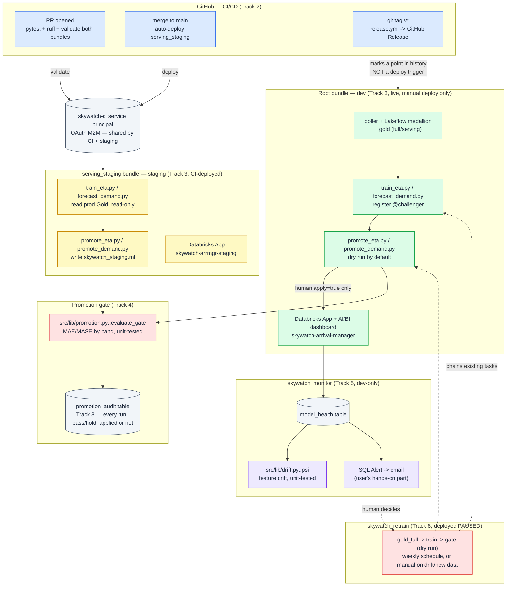

# SkyWatch — MLOps Architecture

The end-to-end picture of `docs/MLOPS_PLAN.md`'s eight tracks, once they're actually built and
verified live rather than just planned. See that document for the track-by-track history and
the real bugs/gotchas found along the way; this is the synthesized reference.

## The whole system

## Design decisions that shaped this, and why

**No literal `prod` target.** The original plan assumed a classic dev/staging/prod ladder.
Two things ruled that out once actually built (`docs/MLOPS_PLAN.md` Track 3): `dev` already
*is* production in every way that matters for this project (it's what the live demo and the
LinkedIn post point at), and Databricks Asset Bundles has no way to exclude a resource from a
target — confirmed empirically, not assumed — combined with Free Edition's one-active-pipeline
limit, which rules out a `staging` target sharing `dev`'s `databricks.yml` at all. The fix was
a **second, separate bundle** (`serving_staging/`), not a third target.

**A human always applies the promotion, never a workflow.** Both `promote_eta.py` and
`promote_demand.py` default to `apply=false`; `skywatch_retrain`'s gate steps hardcode
`apply="false"` — not a variable, so it can't be accidentally flipped at deploy time the way a
shared variable could. A passing gate is a recommendation. This is the one invariant every
other piece of this architecture is built to respect, including the audit log (Track 8),
which records `applied` as its own column precisely so "the gate passed" and "we shipped it"
are never conflated after the fact.

**CI deploys `staging`, never `dev`.** The same reasoning as the target decision, one level
down: automating a deploy to the live environment risked shipping something no human reviewed
straight to what the world sees. `staging` exists specifically to be the thing CI can safely
touch on every merge.

**Monitoring and retraining are `dev`-only.** `staging` never runs its own poller or gold
rebuild (nothing to monitor freshness/volume on, no ingestion to retrain against) — it reads
prod's real Gold tables read-only and only ever produces its own scoring/model artifacts.

## Where to find things

| Question | Look at |
|---|---|
| "How do I do X?" (deploy, rollback, respond to a signal, retrain) | `docs/RUNBOOKS.md` |
| "What is this model, and what are its limits?" | `docs/MODEL_CARDS.md` |
| "What happened, when, and what did we learn?" | `docs/MLOPS_PLAN.md` §6a (the full progress log) |
| "What's the product this all serves?" | `pitch.md`, then the root `README.md` |
