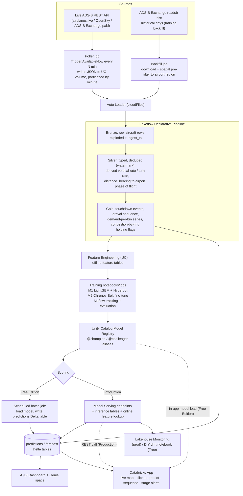

# SkyWatch — ML Roadmap

Turning raw ADS-B transponder data into an **Arrival Manager**: a decision-support tool for a
hub airport that predicts *when each inbound aircraft touches down* and *how many arrivals to
expect over the next three hours*, surfaces the result in dashboards and a Databricks App, and
runs the full model lifecycle on the Databricks ML platform.

This document is the plan. It is deliberately split into a **Free Edition path** (what we build
now, on the constraints we actually have) and a **Production path** (what changes on a paid
workspace). The capability matrix at the end says exactly which features are available where.

---

## 1. Use case

### Problem statement

At a busy hub, arrival demand is spiky. When more aircraft want to land in a 15-minute window
than the runway configuration can accept (the **Airport Acceptance Rate**, AAR), controllers
absorb the excess with vectoring, speed control, and holding — which burns fuel, pushes delay
downstream, and is hard to see coming. Ground handlers, gate/stand planners, and airline hub
control all need the same thing: **an accurate, continuously-updated picture of the arrival
stream 0–3 hours out.**

Real systems that do this (Eurocontrol AMAN, FAA TBFM) are expensive infrastructure. The core
signal they consume — live aircraft position and velocity — is exactly what ADS-B gives us for
free.

### Stakeholders and value

| Stakeholder | Uses the prediction for |
|---|---|
| Airport operations / ANSP | Runway configuration changes, staffing, declaring flow restrictions early |
| Ground handling | Crew and equipment allocation against a ranked touchdown sequence |
| Gate / stand planning | Assigning stands by predicted on-block time |
| Airline hub control | Protecting passenger connections, pre-positioning for irregular ops |
| Sustainability / ops analysis | Quantifying holding fuel burn caused by demand/capacity imbalance |

### Scope (v1)

- **One airport.** Start with **KATL (Atlanta)** — world's busiest by movements (~1,900
  arrivals/day), dense crowd-sourced ADS-B coverage. Alternates: EGLL, EHAM, KORD.
- **Arrivals only.** Departures are a later extension.
- **Horizon:** per-flight ETA from up to ~250 NM out; demand forecast to +3 h.
- **Success is measured against baselines** (Section 7), not in the abstract.

---

## 2. Solution shape (FDE framing)

```
   DATA                 INSIGHT                  MODEL                    SERVE
   ────                 ───────                  ─────                    ─────
 live ADS-B      →   AI/BI dashboard:      →  M1  time-to-touchdown  →  predictions Delta table
 historical           inbound traffic,        (LightGBM, tuned)          + Databricks App:
 backfill             demand vs AAR,       →  M2  demand forecast        live map, click-to-predict,
 medallion            holding, delay          (foundation model,         arrival sequence, surge alerts
 (Bronze/Silver/       Genie space for        fine-tuned)            →  (prod) Model Serving endpoints
  Gold)               ad-hoc questions     →  M3  irregularity           + inference tables + monitoring
                                              early-warning (later)
```

The point of the project is to exercise the **whole platform** end to end, with each modeling
choice justified by the problem rather than picked to show off a feature.

### 2.1 Build split — Genie Code vs repository code

**Genie Code** (Databricks' agentic authoring agent, Agent mode) is the tool for presentation
and exploration work. **Repository code deployed via the Asset Bundle** is the tool for anything
that must be reproducible, testable, and reviewed.

| Work | Tool | Why |
|---|---|---|
| AI/BI dashboards (every version) | **Genie Code** — prompt-driven; then `bundle generate dashboard` to capture into the repo | Dashboards change often; the agent is good at layout/viz; IaC is preserved at the end |
| Exploratory data analysis / pipeline validation | **Genie Code** | Fast profiling before schemas freeze; throwaway |
| Genie Space (end-user Q&A) config | Claude writes instructions + curated table list + starred questions; user pastes | Prose config, not code |
| Medallion transforms | **Repo + DAB** | Correctness-critical; needs diffs and tests |
| Touchdown / labelling logic | **Repo + DAB** | Correctness-critical; unit-tested |
| Feature Engineering tables | **Repo + DAB** | Shared by training and scoring; point-in-time correctness |
| Model training / tuning / registration | **Repo + DAB** | Reproducible, MLflow-tracked |
| Poller job, scoring job | **Repo + DAB** | Production jobs |
| Databricks App | **Repo + DAB** | Reviewed application code |

**Hand-off protocol for every Genie Code task:**

1. Claude posts a prompt in a fenced block headed `GENIE CODE PROMPT — <task>`, delivered when
   the plan reaches that task (not all up front).
2. User opens Genie Code in Agent mode (new AI/BI dashboard, or a notebook for EDA), pastes it,
   reviews the guided plan, accepts.
3. Follow-ups (e.g. "beautify", "fix tile 3") are posted the same way.
4. For dashboards: user runs `databricks bundle generate dashboard --existing-dashboard-id <id>`
   to pull the result into `src/`; Claude then reviews the generated JSON and proposes tweaks
   (further Genie prompts, or direct edits for small fixes).

**Free Edition note:** Genie Code has a monthly allowance (~150 DBUs/user), then pay-as-you-go.
Prompts are written to land a dashboard in one or two passes, not many small iterations, to
stay inside the allowance.

---

## 3. The models

### Model 1 — Time-to-touchdown (ETA)  · *build first*

| | |
|---|---|
| **Question** | For this aircraft, right now, how many minutes until it touches down at the target airport? |
| **ML shape** | Tabular regression. One row per position report of an inbound flight. |
| **Target** | `minutes_to_touchdown` — computed from the labelled touchdown event on the same trajectory (Section 5). |
| **Algorithm** | LightGBM regressor. Baseline: AutoML. Optional v2: a sequence model (GRU / small Transformer) over the last *N* reports. |
| **Tuning** | Hyperopt / Optuna over `num_leaves`, `learning_rate`, `feature_fraction`, `min_child_samples`, `n_estimators`; all trials logged to MLflow. |
| **Why this family** | There is no series to forecast here — it is features → value. Gradient boosting is the right, fast, well-understood tool, and it trains inside Free Edition compute limits. |

### Model 2 — Arrival demand forecast  · *build second*

| | |
|---|---|
| **Question** | How many aircraft will touch down in each future 15-minute bin, out to +3 h? |
| **ML shape** | Univariate time-series forecast. One value per 15-min bin. |
| **Target** | `arrivals_in_bin` — count of labelled touchdown events per bin. |
| **Algorithm** | Fine-tune a pretrained time-series foundation model (**Chronos-Bolt**, or Moirai / TimesFM) on ~90 days of the airport's arrival-count series. Baselines to beat: seasonal-naive, AutoETS/AutoARIMA (`statsforecast`), AutoML forecasting. |
| **Why this family** | ~90 days × 96 bins ≈ 8,600 points — enough to *fine-tune a model with strong priors*, not enough to train a deep forecaster from scratch. This is the exact scenario foundation models exist for, and it is the strongest, most current "fine-tuning" story on Databricks. |
| **Fine-tuning detail** | Chronos-Bolt is small enough for the limited serverless GPU (or CPU, slowly). Covariates: hour-of-day, day-of-week, holiday flag. Report MASE / weighted quantile loss vs each baseline. |

### How M1 and M2 combine in the product

- **0–45 min horizon** — aggregate M1's per-flight ETAs for aircraft already airborne and
  inbound. Precise, grounded in real aircraft.
- **45 min – 3 h horizon** — the aircraft that will land then are not yet detectable, so there
  is nothing to aggregate. M2 carries this, from learned historical patterns.
- The App shows **one continuous demand curve** stitched from both, with the handoff marked.

This is the architecture story: two models, two ML shapes, each earning its place.

### Model 3 — Irregularity early-warning  · *documented now, built later*

| | |
|---|---|
| **Question** | Is this flight likely to hold, go around, divert, or squawk an emergency in the next few minutes? |
| **ML shape** | Short-horizon classification (multi-label or one-vs-rest). |
| **Labels** | Self-generated: holding = racetrack geometry near the airport; go-around = low-altitude approach followed by climb-out and re-approach; diversion = arrival airport changes mid-approach; emergency = `squawk ∈ {7500,7600,7700}` or `emergency` field set. |
| **Challenge** | Emergencies are rare (a handful/day globally) → severe class imbalance. Mitigate by folding in the commoner irregularities (holding, go-around) and reporting precision/recall per class, not accuracy. |
| **Where it lives** | A second panel in the App and the dashboard, and the agreed *second use case* for the portfolio. |

---

## 4. Architecture



---

## 5. Data engineering

### 5.1 Live ingestion

| Source | Cost | Notes |
|---|---|---|
| **adsb.lol** API — *chosen* | free, no key (ODbL, attribute "data from adsb.lol") | `GET /v2/point/<lat>/<lon>/<radius≤250nm>`; envelope `{ac:[…], now:<epoch_ms>, total}` — ADSB-Exchange-v2 schema, matches the `readsb-hist` backfill; verified working from Databricks serverless |
| **adsb.fi** | free, no key | Same data, but different path (`/api/v2/lat/…/lon/…/dist/…`) and envelope (`aircraft`, `now` in seconds) — a documented fallback, not drop-in |
| **airplanes.live** | free *after emailing them* a project description | Was the original pick; the open API now returns HTTP 403 until approved |
| **OpenSky Network** | free (OAuth2 client creds) | Different "state vector" schema; needs a mapping layer |
| **ADS-B Exchange** (RapidAPI) | paid | v2 schema, drop-in via `api_base_url`; for a commercial deployment |

**Pattern (built):** `src/poller.py` polls the current-state JSON for a 250 nm radius around the
airport and writes one raw file per poll to a **UC Volume**, partitioned
`.../<source_name>/dt=YYYY-MM-DD/hh=HH/<now_ms>.json`. The provider is the `api_base_url`
bundle variable — swapping to any v2-compatible host is a one-line change + redeploy.
**Auto Loader** (`cloudFiles`) incrementally ingests into Bronze.

> On Free Edition the poller runs on a schedule (e.g. every 2–5 min), not continuously — see
> the quota note in Section 10. That cadence is fine for demand forecasting and adequate for
> ETA; a paid workspace can run it as a true continuous stream.

### 5.2 Historical backfill (for training)

**Source reality:** `samples.adsbexchange.com/readsb-hist/` has **only the 1st of each month**
(2023-01 → present), *not* continuous days. Each available day is a full 24 h at ~5 s cadence,
served as plain JSON (~6 MB / 13.5k aircraft per file).

**Tooling:** `scripts/backfill_local.py` (run **off Databricks** — the ~6 MB/file download over
10s of GB would blow the Free Edition serverless quota) and the mirror notebook `src/backfill.py`
(job `skywatch_backfill`, for a paid workspace). Both: for each target day at
`--interval` cadence, download the nearest snapshot, keep aircraft within `--radius-nm` of the
field, write it wrapped in the **poller's envelope** (`source='backfill'`). 6 MB file → ~100 KB
landed. Resumable (one output per timestamp). Then upload `backfill/` to the landing Volume and
`--full-refresh-all` the pipeline.

- 3 months × 60 s ≈ 4 320 files ≈ 28 GB pulled, ~350 MB landed, ~2 h local.

**Implication for the models:**
- **M1 (time-to-touchdown):** unaffected — each monthly day ≈ 1 300 KATL arrivals with dense
  tracks; 3–6 days = 4 000–8 000 labelled arrivals across seasons/weekdays. Ample.
- **M2 (demand forecast):** the roadmap assumed ~90 *continuous* days for day-to-day
  autocorrelation — **not available from this source.** Options, decided in Phase 3:
  (a) reframe as a *within-day* forecast (each monthly day = one independent 24 h × 96-bin
  profile — foundation models handle disjoint short series); (b) lean on live-poller data
  accumulated over weeks for the continuous piece, using the monthly backfill for seasonal
  context. Near-term demand (0–45 min) still comes from aggregating M1's live ETAs regardless.

### 5.3 Medallion layers

Schema layout: the raw landing Volume stays at `skywatch.core.landing` (shared infra); the
streaming pipeline writes its tables to **`skywatch.stream.*`** (`live` is a reserved UC schema
name); models go to `skywatch.ml.*`. The older SkyWatch Lite demo keeps `skywatch.core.*`.

**Bronze** `skywatch.stream.bronze_aircraft` — raw aircraft objects exploded from each snapshot,
plus poll-envelope metadata (`snapshot_ts`, `apt_icao`, `_ingest_file`, `_ingest_ts`); the full
per-aircraft object is kept as the `report` struct. Append-only.

**Silver** `skywatch.stream.silver_positions` — one typed, deduped row per aircraft report
(watermark + drop-duplicates on `icao, snapshot_ts`). **Point-wise features only.** Built —
column set finalised from the Phase 1 EDA:

| Field | Source / derivation |
|---|---|
| `icao, callsign, registration, ac_type, category` | passthrough (typed; `callsign` trimmed) |
| `lat, lon, has_position` | passthrough; `has_position` = lat is not null |
| `alt_ft` | `alt_baro`, with the string `"ground"` → 0 |
| `alt_geom_ft` | `alt_geom` (94.9% coverage) |
| `gs_kt, track_deg, squawk, emergency` | passthrough (typed) |
| `baro_rate_fpm, geom_rate_fpm` | passthrough |
| `vertical_rate_fpm`, `vertical_rate_src` | `coalesce(baro_rate, geom_rate)` + which one (`baro`/`geom`/null). Δalt/Δt fill for the ~5% with neither → Gold |
| `sel_altitude_ft` | `nav_altitude_mcp` — selected altitude, a descent-intent signal (76.3%) |
| `sel_heading_deg` | `nav_heading` — selected heading (54.9%) |
| `nic, rc, seen_s, seen_pos_s` | position quality + message/position staleness |
| `dist_to_apt_nm`, `bearing_to_apt` | great-circle from `(lat,lon)` to the airport reference point |
| `heading_err_deg` | `angular_diff(track_deg, bearing_to_apt)` — ~0 = pointed at the field |
| `is_grounded` | `alt_ft ≤ 0 AND gs_kt < 50` (EDA: ground alt alone is noisy) |
| `phase` | **point-wise** rule on `vertical_rate_fpm` + `alt_ft`: ground / climb / descent / cruise / level / unknown. Trajectory phases (approach, go-around) are a Gold job |

**Gold** — batch job `src/build_gold.py` (plain `CREATE OR REPLACE TABLE`, runs on the SQL
warehouse / serverless notebook — *not* in the Lakeflow pipeline). Built and running against
the first sample; touchdown/holding thresholds still need a full arrival wave to tune:

| Table | Contents |
|---|---|
| `gold_tracks` | per `icao` trajectory, ordered, with Δt, derived vertical rate, along-track closure RATE, segment id (gap > 3 min splits) |
| `gold_touchdowns` | one row per detected landing: `icao, callsign, apt, touchdown_ts` |
| `gold_arrival_tracks` | inbound trajectory segments joined to their touchdown (the M1 training set) |
| `gold_demand_15m` | `bin_start_ts, arrivals_in_bin` — the M2 series |
| `gold_congestion` | per minute: inbound aircraft count within `00-40` / `40-100` / `100+` NM rings (`100+` is live-only/informational — backfill's 100 nm coverage boundary, §7), mean gs/alt per ring. "Inbound" = 3+ consecutive decreasing-`dist_to_apt_nm` obs (EDA: single-snapshot heuristic is unreliable) |
| `gold_holding` | racetrack detection — circular-variance heading spread over a rolling window in a small bounding box near the airport (reuses the metric from `src/skywatch_lite.py`) |
| `gold_kpis` | dashboard tiles: current inbound count, next-hour predicted arrivals, AAR headroom, mean holding time |

### 5.4 Labelling logic (self-supervised — no annotation)

**Touchdown event.** For a given `icao`, walking its reports in time order, emit a touchdown at
the first report where `dist_to_apt_nm < 3` **and** `alt_ft` within ~500 ft of field elevation
(KATL 1026 ft) **and** `gs_kt` between ~30 and ~160 **and** the aircraft was descending through
3000 ft AGL in the preceding few minutes. *Detection thresholds to be tuned against the first
captured arrival wave — the 4.5-min EDA sample contained no completed landings.*

**Arrival airport.** The airport whose reference point the trajectory converges on during
descent (nearest known airport to the touchdown point, sanity-checked against approach track).

**Per-report label for M1.** For every report of a trajectory that ends in a touchdown at the
target airport within the lookahead window: `minutes_to_touchdown = (touchdown_ts − snapshot_ts) / 60`.
Discard trajectories with gaps > ~2 min (coverage dropouts) near the airport.

**Demand series for M2.** Bucket `gold_touchdowns` into 15-min bins.

---

## 6. Feature engineering

Registered as **Feature Engineering in Unity Catalog** tables so training and scoring share one
definition and training sets are point-in-time correct.

### M1 features (per inbound report)

| Group | Features |
|---|---|
| Kinematics | `dist_to_apt_nm`, `alt_baro`, `gs`, `vertical_rate`, `turn_rate`, `track_error_deg` |
| Geometry | `bearing_to_apt`, along-track vs cross-track distance, closing speed |
| Aircraft | `category`, coarse type class from `t` (heavy / medium / light), typical approach speed lookup |
| **Airport state (cross-model link)** | inbound count within each ring, mean/percentile ETA of other inbounds, current demand-vs-AAR ratio, holding count |
| Temporal | hour-of-day, day-of-week, local vs UTC, holiday flag |

> The "airport state" group is where M1 depends on live aggregates. In production these come
> from **online tables** for low-latency lookup. On Free Edition they are computed in the same
> batch pass that scores M1 (no online store) — see Section 8.

### M2 features (per 15-min bin)

Target history (lags, rolling means at 1 h / 3 h / 1 d / 1 w), hour-of-day, day-of-week,
holiday flag, optionally a weather covariate later.

---

## 7. Modelling detail & evaluation

### Model 1

- **Split:** by calendar time (train on earlier weeks, validate/test on held-out later weeks) —
  never random row split, which leaks whole trajectories across folds.
- **Baselines:** (a) constant "distance / mean approach speed"; (b) AutoML regression.
- **Primary metric:** MAE in **minutes**, reported **by distance band** (0–40 / 40–100 /
  100–250 NM) — accuracy near the runway matters most for sequencing.
- **Secondary:** P90 absolute error, calibration of the prediction interval, bias by aircraft
  class and time of day.
- **Target to beat:** materially lower MAE than baseline (b) in the 0–100 NM bands.
- **Tracking:** MLflow autolog + a custom `mlflow.evaluate` metrics table; Hyperopt trials as
  child runs; best model registered to `skywatch.ml.eta_touchdown` with `@challenger`, promoted
  to `@champion` after the held-out check.

#### v1–v3 known issues (fixed in the `fix/gold-closure-rate` PR)

1. **`closure_nm` — two defects.** `gold_tracks` computed it as raw `prev_dist − dist` with no
   segment guard, so the first report of every arrival (the archive is 3 disjoint days a month
   apart, `lag()` partitions by `icao` only) pulled `prev_dist` from a prior backfill day —
   181 training rows with impossible `|closure| > 15 nm`. And it was nm-per-report: ~6.7 nm at
   60 s backfill cadence vs ~1.7 nm at 15 s live cadence. → `closure_kt` (a rate, guarded on
   `seg_break = 0`) + `closure_geom_kt` (`gs·cos(heading_err)`, lag-free, covers the first
   reports). The same unguarded expression also drove `inbound_flag`, which feeds a feature,
   `gold_kpis`, and the `WHERE inbound_flag` filter in `score_eta`.
2. **`airport_inbound_count` ring skew.** Backfill keeps aircraft within 100 nm, the live
   poller within 250 nm; the feature summed all `gold_congestion` rings, so the 100–200 /
   200–250 rings are empty in training and populated live. → `WHERE ring IN ('00-40','40-100')`
   in both `build_gold.py` and `score_eta.py`.
3. **Optimistic test MAE.** The final refit early-stopped on the test day itself. → probe on
   the validation day for the tree count, refit on train+val at `best_iteration × 1.15`, no
   test-set peeking. The honest headline is expected slightly above 1.24 min — the leak repaid.

**Deciding the retrain:** the offline test set is all 60 s cadence and *structurally cannot*
show the serving benefit. Judge the fix on the **cadence-distribution query** — `closure_kt`
mean/p90 for the 60 s backfill days vs the 15 s live day should converge to within ~10–15%
(they were ~4× apart on `closure_nm`). The A/B cell (`ab_table_version`, Delta time travel)
gives the apples-to-apples offline number: promote if `MAE_new ≤ MAE_old + 0.05`; the
correctness + skew arguments carry it even at flat MAE.

**Run Gate 1 result (2026-09-04, on the expanded 9-day dataset):** ✅ PASS.
- Cadence-distribution: `closure_kt` mean 188–231 (180 s days) / 192–255 (60 s) / **267** (15 s
  live), p90 all ~390–460 — within ~15–30%, vs ~4× apart on `closure_nm`. Decisive.
- Ring skew confirmed: backfill days have **zero** rows in the 100–200 / 200–250 rings; the
  live day has more inbound there (383 + 282) than in the near rings. `airport_inbound_count`
  is model-importance rank 7 — the fix mattered.
  **100 nm is now the formal coverage boundary** — re-downloading backfill at 250 nm would cost
  another ~50 GB for range nothing in the project uses (M1's evaluated bands and `score_eta`'s
  `max_dist_nm` both top out at ~100–120 nm), so it's not being done. The `100-200`/`200-250`
  rings in `gold_congestion` stay live-only/informational (documented in `build_gold.py`);
  merged into a single `100+` bucket in PR 5 so the schema stops implying precision the data
  never had on 9 of 10 collection days.
- **v4** (18 features, honest val early-stopping): test MAE **1.232** on 2026-09-01,
  RMSE 1.738, by band 1.05 / 1.19 / 1.41 / 1.48 nm, 79 % better than baseline. The *honest*
  number on 9 days matches the old *optimistic* 1.240 on 3 days — the leak repaid by more data.
- `turn_rate_dps` importance rank 11/17 (middle) → kept; candidate for a 60 s-lag serving
  refinement, not a drop.
- A/B cell skipped — `bundle run --var` does not propagate to a deployed job's params (use
  `bundle deploy --var` then `bundle run`), and it would be confounded here (v1 of the table
  was the 3-day / `closure_nm` build). Not blocking given the cadence check + flat MAE.
- Known follow-up: day-boundary snapshots create ~7 junk days in `gold_demand_15m`
  (1 – 2 arrivals, full 96-bin spine each) — filter in `build_gold.py` (PR 5 / M2 prep).

### Model 2

**The archive only has the 1st of each month → no day-to-day continuity.** So Model 2 is a
**within-day forecast**: each day is an independent 96-bin series; given bins `0..T`, predict
`T+1..T+H` (H = 12 = next 3 h). Near-term demand (0–45 min) comes from aggregating Model 1's
live ETAs; Model 2 owns 45 min – 3 h.

- **Code (built):** `src/demand_lib.py` (shared `%run` module — baselines, Chronos wrapper,
  MASE/WQL, `DemandForecastModel` pyfunc wrapper) + `src/forecast_demand.py` /
  `skywatch_forecast_demand` job. Prototyped locally against a reconstructed series
  (`statsforecast` + Chronos-Bolt on CPU).
- **Split:** leave-one-day-out × cut points (`32,44,56,68,80`) → many windows from few days.
- **Baselines:** climatological mean profile (+ day-of-week), seasonal-naive, `blended`
  (climatology nudged toward the context tail at short horizon), context-mean, `statsforecast`
  AutoETS / AutoARIMA.
- **Foundation model:** Chronos-Bolt zero-shot; fine-tune (AutoGluon-TS) behind `run_finetune`.
- **Metrics:** MAE, MASE (vs seasonal-naive, < 1 = beats it), weighted quantile loss.
- **Honest expectation with ≤ ~7 days:** the **climatological mean profile is the model to
  beat** — classical models and zero-shot Chronos can't infer the day's shape from a partial
  day, and 3 days is too few to fine-tune. v1 champion is whichever candidate wins the
  backtest (likely climatology); the fine-tune earns its place at ≥ ~14 backfill days, which
  is a one-parameter change. Promote to `@champion` only if `MASE < 1`.
- **Registered:** `skywatch.ml.demand_forecast`, backtest summary + curves logged as an
  artifact.

*Ordering: PR 5 (touchdown detector recall) should land before Model 2 trains for real —
`gold_demand_15m` is the detector's direct output and ~80% recall under-counts every bin.*

### Combined product metric

End-to-end: MAE of the **stitched demand curve** (M1 aggregate + M2) against actuals, and
**surge-alert precision/recall** — did we flag the bins that actually exceeded AAR, early
enough to act (≥ 30 min lead)?

---

## 8. Serving

### Production path

- **Model Serving endpoints** for M1, M2, M3 — serverless, scale-to-zero, `@champion` alias.
- **Inference tables** auto-log every request/response to Delta.
- M1's endpoint does **online feature lookup** (airport-state features from online tables) so a
  single `POST {hex}` returns a fresh prediction.
- The App calls the endpoints over REST; a scheduled job also batch-scores the full current
  picture for the dashboard.

### Free Edition path (no custom-model serving, no online tables)

- **Scoring job** (scheduled, every N min, `Trigger.AvailableNow`): loads the `@champion`
  models from the UC registry with `mlflow.pyfunc.load_model`, computes the airport-state
  features inline, scores every current inbound and the demand series, and **writes results to
  `skywatch.stream.predictions` / `skywatch.stream.demand_forecast` Delta tables**.
- The **dashboard and App read those Delta tables** via the SQL warehouse — no endpoint needed.
- **Interactive "click-to-predict" in the App** without an endpoint: the App process (Python)
  loads the M1 model from the UC registry **once at startup** and calls `.predict()` in-process
  on demand. Works because Databricks Apps run arbitrary Python and can reach the registry.
- Trade-off: prediction freshness = the scoring-job interval (minutes), not sub-second. Fine
  for this use case at demo scale.

---

## 9. The Databricks App

Streamlit (or Dash). Max 3 apps on Free Edition; auto-stops 24 h after start/redeploy — a
`databricks bundle run` or a scheduled restart keeps it up during demo periods.

| Page / panel | Content | Data source |
|---|---|---|
| **Live map** | Current inbound aircraft (deck.gl), colour by ETA band; predicted track polyline for the next 5 min | `silver_positions` + `predictions` via SQL warehouse |
| **Arrival sequence** | Table of inbounds ranked by predicted touchdown time, with distance, type, confidence band | `predictions` |
| **Demand curve** | Stitched M1+M2 curve to +3 h vs the AAR line; shaded surge windows | `predictions` aggregate + `demand_forecast` |
| **Surge alerts** | Bins where predicted demand > AAR with ≥ 30 min lead; recommended action text | derived |
| **Click-to-predict** | Select any aircraft → in-process M1 prediction + feature contributions | in-app model load |
| **Irregularity panel** (later) | Flights currently flagged holding / go-around / diversion risk, with score | `gold_holding` + M3 |
| **Ops briefing** (later) | LLM-generated paragraph summarising the arrival picture and risks | Foundation Model API |

Auth: app service principal with least-privilege `SELECT` on the serving tables; secrets via
Databricks secrets.

---

## 10. Dashboards & Genie

**AI/BI Dashboard** — built with **Genie Code** (see §2.1 hand-off protocol), then captured into
the repo with `bundle generate dashboard`. KPI tiles (current inbound count, next-hour predicted
arrivals, AAR headroom, mean holding time today), demand-vs-capacity chart, arrival heatmap by
hour, holding events table, model-accuracy tile (yesterday's MAE from the predictions vs actuals
join).

**Genie space** over `silver_positions`, `gold_*`, `predictions`, `demand_forecast` — Claude
supplies the instructions block, curated table list, and starred questions; user creates the
space. Natural language for "how many holding right now?", "busiest 15 minutes predicted this
evening?", "average approach delay by hour last week?".

---

## 11. Monitoring & MLOps

| Concern | Production | Free Edition |
|---|---|---|
| Feature / prediction drift | Lakehouse Monitoring on inference tables | Scheduled notebook computing PSI / KS on feature distributions and predicted-vs-actual error, written to a `model_health` Delta table + dashboard tile |
| Accuracy tracking | Inference table joined to actuals nightly | Same join, in the scoring job |
| Retraining trigger | Monitoring alert → job | Manual / scheduled weekly retrain job |
| CI/CD | Databricks Asset Bundle: pipeline + jobs + models + app + dashboard; unit tests on feature/label logic; `bundle validate` in CI; `@challenger` → `@champion` promotion gated on the held-out metric | Same bundle, fewer resource types |
| Experiment governance | MLflow + UC model registry, aliases, run tags | Same |

---

## 12. Phased plan

Each phase is independently demoable.

### Phase 0 — Foundations
- Provision workspace (Free Edition to start; note the paid-workspace decision point).
- Extend the Asset Bundle: `skywatch.stream` + `skywatch.ml` schemas, landing Volume in `skywatch.core`, new job/pipeline definitions. *(done: poller job, thin-slice medallion)*
- Move the workspace host in `databricks.yml` to a bundle variable / profile (it is currently committed).

### Phase 1 — Real-time ingestion & medallion  *(data → insight)*
- ✅ Poller job (adsb.lol) → UC Volume; Auto Loader → Bronze.
- ✅ **[Genie Code]** EDA pass on the first sample (`SkyWatch EDA: Bronze & Silver Profiling (KATL)`).
- ✅ Silver with kinematics + airport geometry + point-wise phase (column set from the EDA).
- ✅ Gold batch job `src/build_gold.py` (SQL-warehouse CTAS, no pipeline run): `gold_tracks`, `gold_congestion`, `gold_holding`, `gold_touchdowns`, `gold_kpis`. First sample caught 6 landings + realistic ring congestion.
- ✅ `gold_arrival_tracks` (M1 training set) + `gold_demand_15m` (M2 series) built.
- ✅ Historical backfill — 3 full days (2026-07-01 / 08-01 / 09-01) downloaded off-platform via `scripts/backfill_local.py` (concurrent, 25 min), uploaded, ingested via `--full-refresh-all`.
  - Silver ≈ 975 K rows / ~10 K aircraft · `gold_touchdowns` **3,214 landings** (~1,080/day, matches KATL) · `gold_arrival_tracks` **71,600 rows / 3,141 arrivals** · `gold_demand_15m` **384 bins**.
  - Label sanity: avg `minutes_to_touchdown` 5.0 → 22.3 across the 0–10 → 75–100 nm bands; feature nulls < 1.1%. Demand curve shows the real ATL overnight trough + afternoon banks.
- ⏳ Still open: tune touchdown/holding thresholds; a longer *live* collection for day-to-day continuity.

**Phase 1 is functionally complete** — streaming medallion + validated M1 training set + M2 series + dashboard + Genie space. Next: **Phase 2, Model 1.**
- ✅ **[Genie Code]** AI/BI dashboard v1 — "SkyWatch — KATL Arrival Picture" (KPIs, live map, congestion-by-ring, ETA histogram, landings + circling tables). Definition captured at `src/skywatch_arrival_dashboard.lvdash.json`. *Not yet bundle-managed — `bundle deploy` wanted to recreate it (new URL); bind + manage as IaC once v1 churn settles.*
- ✅ Genie space v1 — "SkyWatch — KATL Arrival Manager" (6 tables, 6 starred questions).
- **Platform surface:** Lakeflow Declarative Pipelines, Auto Loader, Structured Streaming, UC Volumes, AI/BI, Genie, Genie Code.

**Phase 1 remaining** (both need a Free Edition quota window):
- Passive ~60–90 min poller collection over a US-evening ATL bank → tune `gold_touchdowns` / `gold_holding` thresholds, build `gold_demand_15m` + `gold_arrival_tracks`.
- Historical backfill job (~90 days, 1 snapshot/min, spatially pre-filtered) — the training-data foundation for Phase 2.

### Phase 2 — Model 1: time-to-touchdown  *(model)*
- ✅ `src/train_eta.py` (`skywatch_train_eta`): features from `gold_arrival_tracks`, LightGBM + Hyperopt (24 trials), time-based split, MAE-by-band eval, registers `skywatch.ml.eta_touchdown`.
- ✅ **v1 trained** (test day 2026-09-01): **MAE 1.24 min** (0–20 nm: 1.02, 70–100 nm: 1.51) vs 5.86 min baseline — **79% better**. RMSE 1.73. `@champion` + `@challenger`.
- ✅ `src/eta_features.py` — shared feature module (`%run` from both train + score), asserts train/serve parity against the model's logged signature.
- ✅ `src/score_eta.py` (`skywatch_score_eta`, every 10 min, PAUSED): loads `@champion`, scores current inbound aircraft → appends `skywatch.stream.predictions`; rebuilds `predictions_scored` (predictions ⋈ actual touchdowns → the accuracy tile).
- ✅ [Genie Code] dashboard v2 — prediction section: arrival-sequence table (ranked by `predicted_touchdown_ts`), accuracy KPIs, error histogram, predicted-vs-actual scatter.
- ⏳ Retrain on more test days; AutoML cross-check (`run_automl=true`).

**Phase 2 is functionally complete** — Model 1 trained, tuned, registered, scored to Delta, and on the dashboard. Next: **Phase 3, Model 2 (demand forecast).**
- Scoring job → `predictions` Delta table.
- **[Genie Code]** dashboard gains the arrival-sequence table and accuracy tile; re-capture.
- **Platform surface:** Feature Engineering in UC, AutoML, MLflow, Hyperopt, UC Model Registry, `mlflow.pyfunc` batch scoring.

### Phase 3 — Model 2: demand forecast  *(fine-tuning centrepiece)*
- Build `gold_demand_15m`; construct backtest windows.
- Baselines: seasonal-naive, `statsforecast` AutoETS/AutoARIMA, AutoML forecast, Chronos-Bolt zero-shot.
- Fine-tune Chronos-Bolt on serverless GPU (CPU fallback); log GPU hours, config, all backtests.
- Register to UC; scoring job extends to write `demand_forecast`.
- **[Genie Code]** dashboard + App show the stitched M1+M2 demand curve and surge alerts.
- **Platform surface:** serverless GPU, foundation-model fine-tuning, MLflow, rolling-origin backtesting.

### Phase 4 — Databricks App  *(serve)*
- Streamlit app: live map, arrival sequence, demand curve, surge alerts, click-to-predict.
- In-app model load for interactive M1 predictions (Free) / REST to endpoint (prod).
- Bundle the app; scheduled restart to beat the 24 h auto-stop.
- **Platform surface:** Databricks Apps, SQL warehouse connectivity, service-principal auth, secrets.

### Phase 5 — Model 3: irregularity early-warning  *(second use case)*
- Label holding / go-around / diversion / emergency from tracks.
- One-vs-rest classifiers; precision/recall per class; register + score.
- App + **[Genie Code]** dashboard irregularity panel.

### Phase 6 — Production hardening
- Move to a paid workspace: real Model Serving endpoints + inference tables, online feature tables, continuous streaming, Lakehouse Monitoring.
- LLM ops-briefing (Foundation Model API or Mosaic AI Model Training).
- Full CI/CD, tests, alerting, cost controls.

---

## 13. Free Edition vs Production — capability matrix

| Capability | Free Edition | Production (paid) | Roadmap impact |
|---|---|---|---|
| Serverless notebooks / jobs | ✅ limited size + usage quota | ✅ | Run pipelines scheduled/triggered, not 24/7 |
| Structured Streaming / Auto Loader | ✅ on serverless (`Trigger.AvailableNow`) | ✅ continuous | Free = micro-batch every N min; prod = continuous |
| Lakeflow Declarative Pipelines (DLT) | ✅ **one active pipeline per type** | ✅ many | Single medallion pipeline — fine for v1 |
| UC Volumes / Unity Catalog / Delta | ✅ | ✅ | No change |
| AI/BI Dashboards + Genie | ✅ | ✅ | No change |
| **Genie Code** (agentic dashboard/EDA authoring) | ✅ **~150 DBU/user/month allowance, then pay-as-you-go** | ✅ | Write prompts to converge in 1–2 passes; dashboards captured to repo via `bundle generate` |
| SQL Warehouse | ✅ one, 2X-Small | ✅ many, any size | App/dashboard reads are light — fine |
| MLflow tracking + UC Model Registry | ✅ | ✅ | No change — full lifecycle works |
| AutoML | ✅ | ✅ | No change |
| Hyperopt / Optuna tuning | ✅ (within compute quota) | ✅ | Keep search spaces modest on Free |
| Serverless GPU compute | ⚠️ limited, LinkedIn-verified, capacity-gated, quota'd | ✅ dedicated GPU | M2 fine-tune is best-effort on Free; **CPU / zero-shot fallback documented** |
| **Custom model serving endpoints** | ❌ not available | ✅ | **Free = batch scoring job → Delta + in-app model load**; prod = REST endpoints |
| Model Serving inference tables | ❌ (no custom endpoints) | ✅ | Free = log predictions to Delta in the scoring job |
| **Online tables / online feature store** | ❌ not supported | ✅ | **Free = compute airport-state features inline in the scoring job** |
| Lakehouse Monitoring | ❌ | ✅ | Free = DIY drift/accuracy notebook → `model_health` table |
| Foundation Model APIs | ⚠️ limited endpoints, no GPU, no provisioned throughput | ✅ | LLM ops-briefing: Free = limited FM API or external; prod = full |
| Mosaic AI Model Training (LLM fine-tune) | ❌ | ✅ | LLM fine-tune is a production-only extension |
| Databricks Apps | ✅ **max 3, auto-stop after 24 h** | ✅ | Scheduled restart keeps the demo app up |
| Vector Search | ✅ one endpoint, one unit, no Direct Vector Access | ✅ | Only needed if we add semantic search later |
| Usage quota | ❗ exceed → compute off for the day (worst case, the month) | soft / billed | **Biggest operational constraint** — batch not continuous, no idle streams, modest tuning |

### Bottom line

**Everything in Phases 1–5 is buildable on Free Edition** with three substitutions:

1. **No real-time serving endpoints** → a scheduled batch scoring job writes predictions to
   Delta; the App loads the model in-process for interactive predictions.
2. **No online tables** → the live airport-state features are computed inside that same scoring
   job instead of being looked up.
3. **GPU is limited** → M2 fine-tuning is attempted on limited serverless GPU with a documented
   CPU / zero-shot fallback, so the phase always produces a working model.

Plus one operational rule: **the quota is the real limit** — pipelines run on a schedule, no
process runs idle, tuning searches stay modest, and the App is restarted on a schedule rather
than left running.

The move to a paid workspace (Phase 6) is what unlocks *real-time* serving, online features,
continuous streaming, automated monitoring, and LLM fine-tuning — it upgrades the same
architecture rather than replacing it.

---

## 14. Decisions

**Settled (2026-09-02):**
- **Airport:** KATL (Atlanta) for v1 — strongest demand-banking signal, densest ADS-B coverage. EGLL added at Model 3 (holding stacks).
- **Live source:** adsb.lol (no key, v2 schema matches the `readsb-hist` backfill, attribute "data from adsb.lol"; verified from Databricks serverless). airplanes.live turned out to require approval. adsb.fi / adsbexchange as fallbacks via `api_base_url`.
- **Start:** Phase 1, live path first; historical backfill is the last task of Phase 1.
- **Dashboards / EDA:** Genie Code (see §2.1). Pipeline/model/app code stays in the repo + DAB.

**Open:**
- **M2 model:** Chronos-Bolt vs Moirai vs TimesFM — decide after the zero-shot baseline bake-off.
- **M1 v2:** also build the sequence-model (Transformer) variant to show that path, or leave it documented?
- **Paid workspace:** when (if at all) do we cross over for the production demo?
