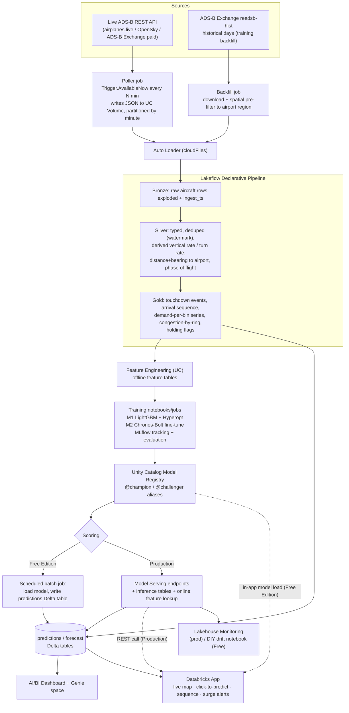

# SkyWatch — ML Roadmap

Turning raw ADS-B transponder data into an **Arrival Manager**: a decision-support tool for a
hub airport that predicts *when each inbound aircraft touches down* and *how many arrivals to
expect over the next three hours*, surfaces the result in dashboards and a Databricks App, and
runs the full model lifecycle on the Databricks ML platform.

This document is the plan. It is deliberately split into a **Free Edition path** (what we build
now, on the constraints we actually have) and a **Production path** (what changes on a paid
workspace). The capability matrix at the end says exactly which features are available where.

---

## 1. Use case

### Problem statement

At a busy hub, arrival demand is spiky. When more aircraft want to land in a 15-minute window
than the runway configuration can accept (the **Airport Acceptance Rate**, AAR), controllers
absorb the excess with vectoring, speed control, and holding — which burns fuel, pushes delay
downstream, and is hard to see coming. Ground handlers, gate/stand planners, and airline hub
control all need the same thing: **an accurate, continuously-updated picture of the arrival
stream 0–3 hours out.**

Real systems that do this (Eurocontrol AMAN, FAA TBFM) are expensive infrastructure. The core
signal they consume — live aircraft position and velocity — is exactly what ADS-B gives us for
free.

### Stakeholders and value

| Stakeholder | Uses the prediction for |
|---|---|
| Airport operations / ANSP | Runway configuration changes, staffing, declaring flow restrictions early |
| Ground handling | Crew and equipment allocation against a ranked touchdown sequence |
| Gate / stand planning | Assigning stands by predicted on-block time |
| Airline hub control | Protecting passenger connections, pre-positioning for irregular ops |
| Sustainability / ops analysis | Quantifying holding fuel burn caused by demand/capacity imbalance |

### Scope (v1)

- **One airport.** Start with **KATL (Atlanta)** — world's busiest by movements (~1,900
  arrivals/day), dense crowd-sourced ADS-B coverage. Alternates: EGLL, EHAM, KORD.
- **Arrivals only.** Departures are a later extension.
- **Horizon:** per-flight ETA from up to ~250 NM out; demand forecast to +3 h.
- **Success is measured against baselines** (Section 7), not in the abstract.

---

## 2. Solution shape (FDE framing)

```
   DATA                 INSIGHT                  MODEL                    SERVE
   ────                 ───────                  ─────                    ─────
 live ADS-B      →   AI/BI dashboard:      →  M1  time-to-touchdown  →  predictions Delta table
 historical           inbound traffic,        (LightGBM, tuned)          + Databricks App:
 backfill             demand vs AAR,       →  M2  demand forecast        live map, click-to-predict,
 medallion            holding, delay          (foundation model,         arrival sequence, surge alerts
 (Bronze/Silver/       Genie space for        fine-tuned)            →  (prod) Model Serving endpoints
  Gold)               ad-hoc questions     →  M3  irregularity           + inference tables + monitoring
                                              early-warning (later)
```

The point of the project is to exercise the **whole platform** end to end, with each modeling
choice justified by the problem rather than picked to show off a feature.

---

## 3. The models

### Model 1 — Time-to-touchdown (ETA)  · *build first*

| | |
|---|---|
| **Question** | For this aircraft, right now, how many minutes until it touches down at the target airport? |
| **ML shape** | Tabular regression. One row per position report of an inbound flight. |
| **Target** | `minutes_to_touchdown` — computed from the labelled touchdown event on the same trajectory (Section 5). |
| **Algorithm** | LightGBM regressor. Baseline: AutoML. Optional v2: a sequence model (GRU / small Transformer) over the last *N* reports. |
| **Tuning** | Hyperopt / Optuna over `num_leaves`, `learning_rate`, `feature_fraction`, `min_child_samples`, `n_estimators`; all trials logged to MLflow. |
| **Why this family** | There is no series to forecast here — it is features → value. Gradient boosting is the right, fast, well-understood tool, and it trains inside Free Edition compute limits. |

### Model 2 — Arrival demand forecast  · *build second*

| | |
|---|---|
| **Question** | How many aircraft will touch down in each future 15-minute bin, out to +3 h? |
| **ML shape** | Univariate time-series forecast. One value per 15-min bin. |
| **Target** | `arrivals_in_bin` — count of labelled touchdown events per bin. |
| **Algorithm** | Fine-tune a pretrained time-series foundation model (**Chronos-Bolt**, or Moirai / TimesFM) on ~90 days of the airport's arrival-count series. Baselines to beat: seasonal-naive, AutoETS/AutoARIMA (`statsforecast`), AutoML forecasting. |
| **Why this family** | ~90 days × 96 bins ≈ 8,600 points — enough to *fine-tune a model with strong priors*, not enough to train a deep forecaster from scratch. This is the exact scenario foundation models exist for, and it is the strongest, most current "fine-tuning" story on Databricks. |
| **Fine-tuning detail** | Chronos-Bolt is small enough for the limited serverless GPU (or CPU, slowly). Covariates: hour-of-day, day-of-week, holiday flag. Report MASE / weighted quantile loss vs each baseline. |

### How M1 and M2 combine in the product

- **0–45 min horizon** — aggregate M1's per-flight ETAs for aircraft already airborne and
  inbound. Precise, grounded in real aircraft.
- **45 min – 3 h horizon** — the aircraft that will land then are not yet detectable, so there
  is nothing to aggregate. M2 carries this, from learned historical patterns.
- The App shows **one continuous demand curve** stitched from both, with the handoff marked.

This is the architecture story: two models, two ML shapes, each earning its place.

### Model 3 — Irregularity early-warning  · *documented now, built later*

| | |
|---|---|
| **Question** | Is this flight likely to hold, go around, divert, or squawk an emergency in the next few minutes? |
| **ML shape** | Short-horizon classification (multi-label or one-vs-rest). |
| **Labels** | Self-generated: holding = racetrack geometry near the airport; go-around = low-altitude approach followed by climb-out and re-approach; diversion = arrival airport changes mid-approach; emergency = `squawk ∈ {7500,7600,7700}` or `emergency` field set. |
| **Challenge** | Emergencies are rare (a handful/day globally) → severe class imbalance. Mitigate by folding in the commoner irregularities (holding, go-around) and reporting precision/recall per class, not accuracy. |
| **Where it lives** | A second panel in the App and the dashboard, and the agreed *second use case* for the portfolio. |

---

## 4. Architecture



---

## 5. Data engineering

### 5.1 Live ingestion

| Source | Cost | Cadence | Notes |
|---|---|---|---|
| **airplanes.live** API | free, rate-limited | ~1–5 s poll | Community feed; good US/EU coverage; check ToS for project use |
| **OpenSky Network** API | free (registered), quota'd | 5–10 s | Research-friendly terms; anonymous users heavily rate-limited |
| **ADS-B Exchange** (RapidAPI) | paid tiers | 1 s | Higher limits, commercial-friendlier licensing |

**Pattern:** a small poller (Databricks job with `Trigger.AvailableNow`, run every N minutes;
or a lightweight external container) fetches the current-state JSON, filters to a bounding box
around the target airport, and writes one file per poll to a **UC Volume**, partitioned
`.../dt=YYYY-MM-DD/hh=HH/`. **Auto Loader** (`cloudFiles`) incrementally ingests into Bronze.

> On Free Edition the poller runs on a schedule (e.g. every 2–5 min), not continuously — see
> the quota note in Section 10. That cadence is fine for demand forecasting and adequate for
> ETA; a paid workspace can run it as a true continuous stream.

### 5.2 Historical backfill (for training)

The `readsb-hist` archive at `samples.adsbexchange.com/readsb-hist/<yyyy>/<mm>/<dd>/` has one
global snapshot every ~5 s, for individual days going back years. For training we need calendar
coverage, not global coverage:

1. For each of ~60–90 historical days, download **one snapshot per minute** (1,440 files/day,
   not 17k), and **spatially pre-filter** each to the airport's bounding box before writing —
   keeps the training Volume small.
2. Land the filtered rows through the same Auto Loader → Bronze path (a `source='backfill'`
   tag distinguishes them).
3. ~90 days at KATL ≈ 170k labelled arrivals for M1 and ≈ 8,600 demand bins for M2.

### 5.3 Medallion layers

**Bronze** `skywatch.core.bronze_aircraft` — raw aircraft objects exploded from each snapshot,
plus `ingest_ts`, `snapshot_ts`, `source`. Append-only.

**Silver** `skywatch.core.silver_positions` — one typed, deduped row per aircraft report
(watermark + drop-duplicates on `hex, snapshot_ts`). Fields:

| Field | Source / derivation |
|---|---|
| `hex, flight, r, t, category` | passthrough |
| `lat, lon, alt_baro, gs, track, squawk, emergency` | passthrough (typed) |
| `snapshot_ts` | from snapshot filename |
| `vertical_rate` | Δ`alt_baro` / Δt over consecutive reports of the same `hex` (use feed's `baro_rate` if present) |
| `turn_rate` | Δ`track` / Δt |
| `dist_to_apt_nm`, `bearing_to_apt` | great-circle from `(lat,lon)` to airport reference point |
| `track_error_deg` | `angular_diff(track, bearing_to_apt)` |
| `phase` | rule on `alt_baro` + `vertical_rate` + `gs`: climb / cruise / descent / approach / ground |

**Gold**

| Table | Contents |
|---|---|
| `gold_touchdowns` | one row per detected landing: `hex, flight, apt, touchdown_ts, runway_guess` |
| `gold_arrival_tracks` | inbound trajectory segments joined to their touchdown (the M1 training set) |
| `gold_demand_15m` | `bin_start_ts, arrivals_in_bin` — the M2 series |
| `gold_congestion` | every minute: inbound aircraft count within 50 / 100 / 200 / 300 NM rings, mean gs/alt per ring |
| `gold_holding` | flights currently in a racetrack pattern near the airport |
| `gold_kpis` | dashboard tiles: current inbound count, next-hour predicted arrivals, AAR headroom, mean holding time |

### 5.4 Labelling logic (self-supervised — no annotation)

**Touchdown event.** For a given `hex`, walking its reports in time order, emit a touchdown when:
`dist_to_apt_nm < 3` **and** `alt_baro` within ~500 ft of field elevation **and** `gs` dropped
below ~80 kt **and** the aircraft was in `approach` phase in the preceding minutes. `touchdown_ts`
= first report meeting the condition.

**Arrival airport.** The airport whose reference point the trajectory converges on during
descent (nearest known airport to the touchdown point, sanity-checked against approach track).

**Per-report label for M1.** For every report of a trajectory that ends in a touchdown at the
target airport within the lookahead window: `minutes_to_touchdown = (touchdown_ts − snapshot_ts) / 60`.
Discard trajectories with gaps > ~2 min (coverage dropouts) near the airport.

**Demand series for M2.** Bucket `gold_touchdowns` into 15-min bins.

---

## 6. Feature engineering

Registered as **Feature Engineering in Unity Catalog** tables so training and scoring share one
definition and training sets are point-in-time correct.

### M1 features (per inbound report)

| Group | Features |
|---|---|
| Kinematics | `dist_to_apt_nm`, `alt_baro`, `gs`, `vertical_rate`, `turn_rate`, `track_error_deg` |
| Geometry | `bearing_to_apt`, along-track vs cross-track distance, closing speed |
| Aircraft | `category`, coarse type class from `t` (heavy / medium / light), typical approach speed lookup |
| **Airport state (cross-model link)** | inbound count within each ring, mean/percentile ETA of other inbounds, current demand-vs-AAR ratio, holding count |
| Temporal | hour-of-day, day-of-week, local vs UTC, holiday flag |

> The "airport state" group is where M1 depends on live aggregates. In production these come
> from **online tables** for low-latency lookup. On Free Edition they are computed in the same
> batch pass that scores M1 (no online store) — see Section 8.

### M2 features (per 15-min bin)

Target history (lags, rolling means at 1 h / 3 h / 1 d / 1 w), hour-of-day, day-of-week,
holiday flag, optionally a weather covariate later.

---

## 7. Modelling detail & evaluation

### Model 1

- **Split:** by calendar time (train on earlier weeks, validate/test on held-out later weeks) —
  never random row split, which leaks whole trajectories across folds.
- **Baselines:** (a) constant "distance / mean approach speed"; (b) AutoML regression.
- **Primary metric:** MAE in **minutes**, reported **by distance band** (0–40 / 40–100 /
  100–250 NM) — accuracy near the runway matters most for sequencing.
- **Secondary:** P90 absolute error, calibration of the prediction interval, bias by aircraft
  class and time of day.
- **Target to beat:** materially lower MAE than baseline (b) in the 0–100 NM bands.
- **Tracking:** MLflow autolog + a custom `mlflow.evaluate` metrics table; Hyperopt trials as
  child runs; best model registered to `skywatch.ml.eta_touchdown` with `@challenger`, promoted
  to `@champion` after the held-out check.

### Model 2

- **Split:** rolling-origin backtest (multiple forecast start points across the held-out period).
- **Baselines:** seasonal-naive (same bin last week), AutoETS / AutoARIMA (`statsforecast`),
  AutoML forecasting, **Chronos-Bolt zero-shot** (no fine-tune) — so the fine-tune has to earn
  its complexity.
- **Primary metric:** MASE and weighted quantile loss vs each baseline, by horizon (0–1 h /
  1–2 h / 2–3 h).
- **Target to beat:** fine-tuned model beats zero-shot and seasonal-naive across all horizons.
- **Tracking:** fine-tune run logs base model, LoRA/full-FT config, GPU hours, all backtest
  windows; registered to `skywatch.ml.demand_forecast`.

### Combined product metric

End-to-end: MAE of the **stitched demand curve** (M1 aggregate + M2) against actuals, and
**surge-alert precision/recall** — did we flag the bins that actually exceeded AAR, early
enough to act (≥ 30 min lead)?

---

## 8. Serving

### Production path

- **Model Serving endpoints** for M1, M2, M3 — serverless, scale-to-zero, `@champion` alias.
- **Inference tables** auto-log every request/response to Delta.
- M1's endpoint does **online feature lookup** (airport-state features from online tables) so a
  single `POST {hex}` returns a fresh prediction.
- The App calls the endpoints over REST; a scheduled job also batch-scores the full current
  picture for the dashboard.

### Free Edition path (no custom-model serving, no online tables)

- **Scoring job** (scheduled, every N min, `Trigger.AvailableNow`): loads the `@champion`
  models from the UC registry with `mlflow.pyfunc.load_model`, computes the airport-state
  features inline, scores every current inbound and the demand series, and **writes results to
  `skywatch.core.predictions` / `skywatch.core.demand_forecast` Delta tables**.
- The **dashboard and App read those Delta tables** via the SQL warehouse — no endpoint needed.
- **Interactive "click-to-predict" in the App** without an endpoint: the App process (Python)
  loads the M1 model from the UC registry **once at startup** and calls `.predict()` in-process
  on demand. Works because Databricks Apps run arbitrary Python and can reach the registry.
- Trade-off: prediction freshness = the scoring-job interval (minutes), not sub-second. Fine
  for this use case at demo scale.

---

## 9. The Databricks App

Streamlit (or Dash). Max 3 apps on Free Edition; auto-stops 24 h after start/redeploy — a
`databricks bundle run` or a scheduled restart keeps it up during demo periods.

| Page / panel | Content | Data source |
|---|---|---|
| **Live map** | Current inbound aircraft (deck.gl), colour by ETA band; predicted track polyline for the next 5 min | `silver_positions` + `predictions` via SQL warehouse |
| **Arrival sequence** | Table of inbounds ranked by predicted touchdown time, with distance, type, confidence band | `predictions` |
| **Demand curve** | Stitched M1+M2 curve to +3 h vs the AAR line; shaded surge windows | `predictions` aggregate + `demand_forecast` |
| **Surge alerts** | Bins where predicted demand > AAR with ≥ 30 min lead; recommended action text | derived |
| **Click-to-predict** | Select any aircraft → in-process M1 prediction + feature contributions | in-app model load |
| **Irregularity panel** (later) | Flights currently flagged holding / go-around / diversion risk, with score | `gold_holding` + M3 |
| **Ops briefing** (later) | LLM-generated paragraph summarising the arrival picture and risks | Foundation Model API |

Auth: app service principal with least-privilege `SELECT` on the serving tables; secrets via
Databricks secrets.

---

## 10. Dashboards & Genie

**AI/BI Dashboard** — KPI tiles (current inbound count, next-hour predicted arrivals, AAR
headroom, mean holding time today), demand-vs-capacity chart, arrival heatmap by hour, holding
events table, model-accuracy tile (yesterday's MAE from the predictions vs actuals join).

**Genie space** over `silver_positions`, `gold_*`, `predictions`, `demand_forecast` — natural
language for "how many holding right now?", "busiest 15 minutes predicted this evening?",
"average approach delay by hour last week?".

---

## 11. Monitoring & MLOps

| Concern | Production | Free Edition |
|---|---|---|
| Feature / prediction drift | Lakehouse Monitoring on inference tables | Scheduled notebook computing PSI / KS on feature distributions and predicted-vs-actual error, written to a `model_health` Delta table + dashboard tile |
| Accuracy tracking | Inference table joined to actuals nightly | Same join, in the scoring job |
| Retraining trigger | Monitoring alert → job | Manual / scheduled weekly retrain job |
| CI/CD | Databricks Asset Bundle: pipeline + jobs + models + app + dashboard; unit tests on feature/label logic; `bundle validate` in CI; `@challenger` → `@champion` promotion gated on the held-out metric | Same bundle, fewer resource types |
| Experiment governance | MLflow + UC model registry, aliases, run tags | Same |

---

## 12. Phased plan

Each phase is independently demoable.

### Phase 0 — Foundations
- Provision workspace (Free Edition to start; note the paid-workspace decision point).
- Extend the Asset Bundle: `skywatch.ml` schema, Volumes for landing + backfill, new job/pipeline definitions.
- Move the workspace host in `databricks.yml` to a bundle variable / profile (it is currently committed).

### Phase 1 — Real-time ingestion & medallion  *(data → insight)*
- Poller job → UC Volume; Auto Loader → Bronze.
- Silver with derived kinematics + airport geometry + phase.
- Gold: touchdown detection, demand series, congestion rings, holding flags.
- Historical backfill job (~90 days, minute cadence, spatially pre-filtered).
- AI/BI dashboard v1 + Genie space (no predictions yet — just the live picture).
- **Platform surface:** Lakeflow Declarative Pipelines, Auto Loader, Structured Streaming, UC Volumes, AI/BI, Genie.

### Phase 2 — Model 1: time-to-touchdown  *(model)*
- Feature Engineering tables for M1.
- AutoML baseline → LightGBM → Hyperopt tuning, all in MLflow.
- Time-based split, MAE-by-distance-band evaluation, register to UC.
- Scoring job → `predictions` Delta table.
- Dashboard gains the arrival-sequence table and accuracy tile.
- **Platform surface:** Feature Engineering in UC, AutoML, MLflow, Hyperopt, UC Model Registry, `mlflow.pyfunc` batch scoring.

### Phase 3 — Model 2: demand forecast  *(fine-tuning centrepiece)*
- Build `gold_demand_15m`; construct backtest windows.
- Baselines: seasonal-naive, `statsforecast` AutoETS/AutoARIMA, AutoML forecast, Chronos-Bolt zero-shot.
- Fine-tune Chronos-Bolt on serverless GPU (CPU fallback); log GPU hours, config, all backtests.
- Register to UC; scoring job extends to write `demand_forecast`.
- Dashboard + App show the stitched M1+M2 demand curve and surge alerts.
- **Platform surface:** serverless GPU, foundation-model fine-tuning, MLflow, rolling-origin backtesting.

### Phase 4 — Databricks App  *(serve)*
- Streamlit app: live map, arrival sequence, demand curve, surge alerts, click-to-predict.
- In-app model load for interactive M1 predictions (Free) / REST to endpoint (prod).
- Bundle the app; scheduled restart to beat the 24 h auto-stop.
- **Platform surface:** Databricks Apps, SQL warehouse connectivity, service-principal auth, secrets.

### Phase 5 — Model 3: irregularity early-warning  *(second use case)*
- Label holding / go-around / diversion / emergency from tracks.
- One-vs-rest classifiers; precision/recall per class; register + score.
- App + dashboard irregularity panel.

### Phase 6 — Production hardening
- Move to a paid workspace: real Model Serving endpoints + inference tables, online feature tables, continuous streaming, Lakehouse Monitoring.
- LLM ops-briefing (Foundation Model API or Mosaic AI Model Training).
- Full CI/CD, tests, alerting, cost controls.

---

## 13. Free Edition vs Production — capability matrix

| Capability | Free Edition | Production (paid) | Roadmap impact |
|---|---|---|---|
| Serverless notebooks / jobs | ✅ limited size + usage quota | ✅ | Run pipelines scheduled/triggered, not 24/7 |
| Structured Streaming / Auto Loader | ✅ on serverless (`Trigger.AvailableNow`) | ✅ continuous | Free = micro-batch every N min; prod = continuous |
| Lakeflow Declarative Pipelines (DLT) | ✅ **one active pipeline per type** | ✅ many | Single medallion pipeline — fine for v1 |
| UC Volumes / Unity Catalog / Delta | ✅ | ✅ | No change |
| AI/BI Dashboards + Genie | ✅ | ✅ | No change |
| SQL Warehouse | ✅ one, 2X-Small | ✅ many, any size | App/dashboard reads are light — fine |
| MLflow tracking + UC Model Registry | ✅ | ✅ | No change — full lifecycle works |
| AutoML | ✅ | ✅ | No change |
| Hyperopt / Optuna tuning | ✅ (within compute quota) | ✅ | Keep search spaces modest on Free |
| Serverless GPU compute | ⚠️ limited, LinkedIn-verified, capacity-gated, quota'd | ✅ dedicated GPU | M2 fine-tune is best-effort on Free; **CPU / zero-shot fallback documented** |
| **Custom model serving endpoints** | ❌ not available | ✅ | **Free = batch scoring job → Delta + in-app model load**; prod = REST endpoints |
| Model Serving inference tables | ❌ (no custom endpoints) | ✅ | Free = log predictions to Delta in the scoring job |
| **Online tables / online feature store** | ❌ not supported | ✅ | **Free = compute airport-state features inline in the scoring job** |
| Lakehouse Monitoring | ❌ | ✅ | Free = DIY drift/accuracy notebook → `model_health` table |
| Foundation Model APIs | ⚠️ limited endpoints, no GPU, no provisioned throughput | ✅ | LLM ops-briefing: Free = limited FM API or external; prod = full |
| Mosaic AI Model Training (LLM fine-tune) | ❌ | ✅ | LLM fine-tune is a production-only extension |
| Databricks Apps | ✅ **max 3, auto-stop after 24 h** | ✅ | Scheduled restart keeps the demo app up |
| Vector Search | ✅ one endpoint, one unit, no Direct Vector Access | ✅ | Only needed if we add semantic search later |
| Usage quota | ❗ exceed → compute off for the day (worst case, the month) | soft / billed | **Biggest operational constraint** — batch not continuous, no idle streams, modest tuning |

### Bottom line

**Everything in Phases 1–5 is buildable on Free Edition** with three substitutions:

1. **No real-time serving endpoints** → a scheduled batch scoring job writes predictions to
   Delta; the App loads the model in-process for interactive predictions.
2. **No online tables** → the live airport-state features are computed inside that same scoring
   job instead of being looked up.
3. **GPU is limited** → M2 fine-tuning is attempted on limited serverless GPU with a documented
   CPU / zero-shot fallback, so the phase always produces a working model.

Plus one operational rule: **the quota is the real limit** — pipelines run on a schedule, no
process runs idle, tuning searches stay modest, and the App is restarted on a schedule rather
than left running.

The move to a paid workspace (Phase 6) is what unlocks *real-time* serving, online features,
continuous streaming, automated monitoring, and LLM fine-tuning — it upgrades the same
architecture rather than replacing it.

---

## 14. Open questions / decisions

- **Airport:** KATL confirmed, or a European hub for different traffic patterns?
- **Live source:** airplanes.live vs OpenSky vs paid — depends on ToS tolerance for a portfolio project.
- **M2 model:** Chronos-Bolt vs Moirai vs TimesFM — decide after the zero-shot baseline bake-off.
- **M1 v2:** do we also build the sequence-model (Transformer) variant to show that path, or leave it documented?
- **Paid workspace:** when (if at all) do we cross over for the production demo?
